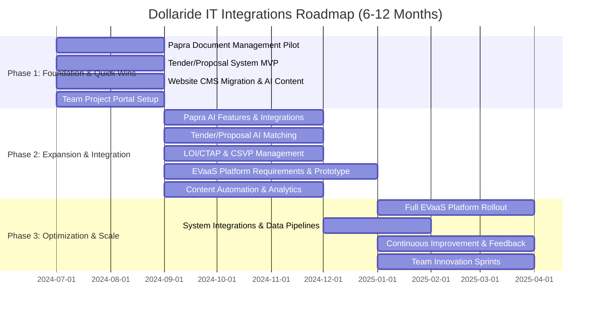

# Dollaride IT Integrations Proposal

## Executive Summary

Dollaride, as an innovative EV startup, stands to gain significant operational and competitive advantages by integrating AI and modern IT solutions into its core workflows. This proposal outlines a comprehensive integration strategy, leveraging open-source and best-in-class platforms, to streamline document management, automate tender and proposal processes, enhance content management, and evolve the EVaaS platform. The approach is modular, scalable, and designed for rapid, measurable impact within a 6–12 month timeline.

---

## 1. AI-Enabled Document Management Platform

**Solution:** Deploy and customize [Papra](https://github.com/papra-hq/papra), an open-source document management system, with AI-powered features.

**Scope:**
- Centralized, secure repository for all company documents (contracts, tenders, proposals, compliance, etc.).
- AI-driven document tagging, search, and content extraction (OCR, NLP).
- Automated document ingestion (email, folder, API).
- Role-based access, audit trails, and compliance support.
- Integration with existing tools (Google Workspace, Slack, etc.).

**Benefits:**
- Reduced manual document handling and retrieval time.
- Improved compliance and audit readiness.
- Enhanced knowledge sharing and collaboration.

---

## 2. Tender / Proposal Management System

**Solution:** Build a custom AI-powered tender management module.

**Scope:**
- Automated tender sourcing from public/private databases.
- AI-based suitability matching (matching tenders to Dollaride's capabilities and strategic goals).
- Workflow for proposal creation, review, and submission.
- Analytics dashboard for win/loss tracking and insights.

**Benefits:**
- Increased pipeline of relevant opportunities.
- Higher win rates through better matching and faster response.
- Data-driven decision-making for business development.

---

## 3. CTAP - LOI Management & Insights

**Solution:** Develop a Letter of Intent (LOI) and CTAP (Customer/Client Technical Assistance Program) management system.

**Scope:**
- Centralized LOI repository with status tracking.
- AI-powered insights: likelihood of conversion, risk analysis, and next-step recommendations.
- Automated reminders and workflow triggers.

**Benefits:**
- Improved conversion rates and reduced deal cycle times.
- Proactive risk management and follow-up.

---

## 4. CSVP Management – Content Distribution & Improvement

**Solution:** Implement a platform for managing and distributing CSVP (Customer Success Value Proposition) content.

**Scope:**
- Central repository for CSVP materials.
- AI-driven content improvement suggestions (clarity, tone, impact).
- Automated distribution to relevant stakeholders and channels.

**Benefits:**
- Consistent, high-quality messaging.
- Faster content updates and distribution.

---

## 5. EVaaS Platform Evolution

**Solution:** Define and develop the next generation of Dollaride's EVaaS (EV as a Service) platform.

**Scope:**
- Requirements gathering and benchmarking.
- Modular platform architecture (fleet management, billing, analytics, customer portal).
- AI-driven features: predictive maintenance, route optimization, demand forecasting.
- Integration with IoT, payment, and regulatory systems.

**Benefits:**
- Market differentiation through advanced features.
- Scalable, future-proof platform.

---

## 6. Website Management & Improvement

**Solution:** Modernize Dollaride's website for performance, accessibility, and content agility.

**Scope:**
- Migration to a modern CMS (e.g., headless CMS).
- AI-powered content generation and SEO optimization.
- Analytics and A/B testing for continuous improvement.

**Benefits:**
- Improved user experience and engagement.
- Faster content updates and campaign launches.

---

## 7. Content Management, Generation & Distribution

**Solution:** Deploy AI tools for content creation, translation, and omnichannel distribution.

**Scope:**
- AI-assisted copywriting, translation, and summarization.
- Automated publishing to web, social, and internal channels.
- Content performance analytics.

**Benefits:**
- Increased content output with reduced manual effort.
- Consistent brand voice across channels.

---

## 8. Team-Generated Projects

**Solution:** Establish a framework for team-driven innovation.

**Scope:**
- Internal portal for project idea submission and voting.
- Quarterly hackathons or innovation sprints.
- Resource allocation for high-impact ideas.

**Benefits:**
- Increased team engagement and ownership.
- Pipeline of innovative projects aligned with business goals.

---

## Implementation Strategy

### Phase 1 (Months 1–3): Foundation & Quick Wins
- Deploy Papra for document management (pilot with key teams).
- Launch tender/proposal management MVP.
- Website CMS migration and initial AI content tools.
- Set up team project portal.

### Phase 2 (Months 4–8): Expansion & Integration
- Integrate AI features (tagging, search, suitability matching).
- Roll out LOI/CTAP and CSVP management modules.
- Begin EVaaS platform evolution (requirements, prototyping).
- Expand content automation and analytics.

### Phase 3 (Months 9–12): Optimization & Scale
- Full EVaaS platform rollout.
- Deep integration across systems (APIs, SSO, data pipelines).
- Continuous improvement: feedback loops, performance tuning.
- Team innovation sprints and project launches.

---

## Potential Benefits

- **Operational Efficiency:** Automation reduces manual work, freeing up staff for higher-value tasks.
- **Faster Project Delivery:** Streamlined workflows and AI assistance accelerate execution.
- **Data-Driven Decisions:** Centralized data and analytics enable smarter, faster decisions.
- **Competitive Advantage:** Advanced EVaaS features and AI-driven processes differentiate Dollaride in the market.
- **Scalability:** Modular, open-source solutions support future growth and adaptation.

---

## Execution Patterns & Step-by-Step Breakdown

### 1. AI-Enabled Document Management Platform (Papra)
- Discovery & Requirements: Stakeholder interviews, workflow mapping.
- Pilot Deployment: Sandbox setup, sample document import.
- Customization: AI modules for OCR, tagging, search; permissions.
- Integration: Email, Slack, Google Drive, etc.
- Training & Rollout: Staff onboarding, phased launch.
- Continuous Improvement: Feedback, monitoring, iteration.

### 2. Tender / Proposal Management System
- Requirements Gathering: Map lifecycle, pain points.
- Tender Sourcing Automation: Scrapers/APIs for tender feeds.
- AI Suitability Matching: NLP for requirements/capabilities.
- Workflow Automation: Kanban boards, reminders.
- Proposal Generation: Templates, AI drafting.
- Analytics: Dashboards for win/loss, bottlenecks.

### 3. CTAP - LOI Management & Insights
- Centralized LOI Repository: Secure, searchable database.
- Status Tracking: Visual indicators, status fields.
- AI Insights: Risk, conversion likelihood, next actions.
- Automated Reminders: Follow-ups, renewals.
- Reporting: Regular management reports.

### 4. CSVP Management – Content Distribution & Improvement
- Content Audit: Inventory existing materials.
- Central Repository: Structured, searchable storage.
- AI Content Improvement: Suggestions, version control.
- Automated Distribution: Workflows for sharing, feedback.

### 5. EVaaS Platform Evolution
- Discovery & Benchmarking: Analyze platform, competitors.
- Modular Architecture Design: Define core modules.
- AI Feature Integration: Predictive maintenance, routing, forecasting.
- Prototyping & User Testing: MVPs, user feedback.
- Iterative Development: Agile sprints.

### 6. Website Management & Improvement
- Audit & Planning: Review performance, accessibility.
- CMS Migration: Move to headless CMS.
- AI Content Tools: Generation, SEO, translation.
- Continuous Improvement: Analytics, A/B testing.

### 7. Content Management, Generation & Distribution
- Content Strategy: Define types, channels, frequency.
- AI-Assisted Creation: Drafting, summarizing, translating.
- Omnichannel Distribution: Automated publishing.
- Performance Analytics: Track reach, engagement.

### 8. Team-Generated Projects
- Idea Portal: Internal submission/voting platform.
- Innovation Sprints: Hackathons, prototyping.
- Resource Allocation: Budget, time for projects.
- Recognition & Feedback: Celebrate, share learnings.

---

## Visual Roadmap (Gantt Chart)

---

**References:**
- [Papra - Open Source Document Management](https://github.com/papra-hq/papra)
- [Papra Demo](https://demo.papra.app) 